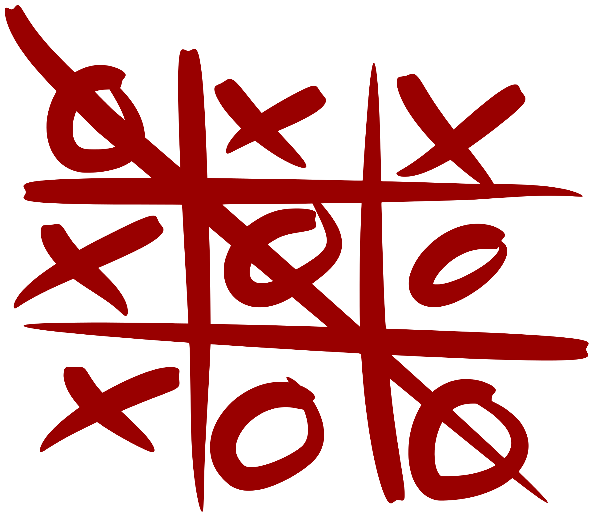

```{r setup, include=FALSE}
require(knitr)
require(kableExtra)
require(ggplot2)
require(reshape2)
require(data.tree)

#Knitr table options
options(knitr.table.format = "html") 

#Chunk options
opts_chunk$set(echo = FALSE)
opts_chunk$set(results = 'asis')
opts_chunk$set(fig.width  = 4)
opts_chunk$set(fig.height = 4)
opts_chunk$set(fig.align='center')

#Function for authomatic theorem, corollary, example, counterexample, property, lemma and definition numbering
source("Rfun/theorem_creator.R")
```

# El problema del muestreo
Considera toda la población de México (país). [Según la más reciente estimación del INEGI](https://en.www.inegi.org.mx/temas/estructura/), en 2015 la población del país era de 119,938,473 habitantes. Supongamos que nos interesa hacer una encuesta para saber cuál partido político prefiere cada persona de tal forma que: 

1. Se pueden hacer campañas dirigidas (por ejemplo, si las mujeres jóvenes muestran aversión a nuestro partido, hacer una campaña específica para ellas)

2. Poder predecir si nuestro partido ganará la elección presidencial o no.

3. Predecir en qué regiones nuestro partido contará con miembros del congreso y en cuáles no. 

Para lograr esto una opción sería salir a la calle y preguntar a todos los habitantes cuál es su partido preferido. Empero, esto es carísimo. ¿Te imaginas la cantidad de tiempo y personas que se requieren? 

La idea (bastante antigua^[ [John Graunt](file:///home/rod/Downloads/2009-15-x10-pub.pdf) fue de los primeros a quienes se les ocurrió.]) es tomar un pedazo aleatorio de la población (muestra aleatoria), y asumir que el resto es igual. Si el pedazo fuera _lo suficientemente aleatorio_ podríamos asumir que la proporción de gente que votará por nuestro partido, será la misma en la población total que en nuestra muestra.  

```{r}
set.seed(2364)
dat <- data.frame(x = c(rnorm(500, sd = 0.5), rnorm(100, 3, sd = 0.2)),
           y = c(rnorm(500, sd = 0.5), rnorm(100, sd = 0.2)),
           Partido = sample(c("A","B","C"), 600, replace = TRUE))
ggplot(dat, aes(x = x, y = y, color = Partido)) + geom_point() +
  theme_void() + 
  annotate("text", x = 0, y = -2, label = "Población") +
  annotate("text", x = 3, y = -2, label = "Muestra") +
  xlim(c(-3,6)) +
  geom_vline(aes(xintercept = 2)) +
  theme(legend.position = "bottom")
```

Para poder hablar de la muestra vamos a considerar notación:

+ $N$ representará el tamaño de la población total ($N \in \mathbb{N}$).
+ $n$ representará el tamaño de la muestra ($n \in \mathbb{N}$).

Por construcción, $n \leq N$ y, durante estas notas, $0\not\in\mathbb{N}$. 
Hay varias preguntas que surgen de este procedimiento:

1. ¿Cómo debe tomarse la muestra?

2. ¿De qué tamaño tiene que ser la muestra para que sean buenas sus predicciones?^[Considera que si, por ejemplo, sólo entrevistamos a una persona, entonces pensaríamos que el $100\%$ de la población tiene las preferencias de esa persona, lo cual no tiene sentido. ]

Antes de resolver estas preguntas, repasemos tres de los principios fundamentales de conteo. 

## Principio de adición

El principio de la adición se basa en la siguiente proposición de teoría de conjuntos: 


```{r}
teo <- "
Sean $A$, $B$ conjuntos disjuntos ($A\\cap B = \\emptyset$) Denotemos su cardinalidad como $|A|$ y $|B|$ respectivamente. Entonces:
$$
|A \\cup B| = |A| + |B|. 
$$
"

proof <- "
Sea $x\\in A$. Como es disjunto cada $x$ en $A$ no está en $B$ por lo tanto un $x \\in A \\cup B$ que venía de $A$ sólo lo contamos una vez. Análogamente, para cada $y$ en $B$, como se tiene $y \\not\\in A$ entonces cada uno de los $y$ en $B$ está en $A\\cup B$. Dado que son disjuntos no se repite ningún elemento por lo que:
$$
|A \\cup B| = |A| + |B|. 
$$
"

build_theorem("Proposición",teo, proof = proof, name = "Cardinalidad de la unión", id ="cunion" )
```

Veamos un ejemplo sencillo de aplicación; la divesión empieza más adelante cuando combinemos con el principio de la multipicación:

```{r}
teo <- "Se avienta una moneda justa (es decir que cae tantas veces águila como sol). Si cae Águila, entonces se selecciona al azar (con igual probabilidad) un cuaderno rojo o verde. Si cae Sol, entonces se selecciona al azar un cuaderno violeta, azul o negro. ¿Cuántos cuadernos posibles hay?"

proof <- "Sea $A = \\{\\text{Rojo},\\text{Verde} \\}$ el conjunto con los resultados de tirar Águila. Sea $S = \\{\\text{Violeta},\\text{Azul},\\text{Negro} \\}$ el conjunto con los resultados de tirar Sol. El total de los cuadernos está dado por:
$$
A \\cup S =  \\{\\text{Rojo},\\text{Verde},\\text{Violeta},\\text{Azul},\\text{Negro} \\}
$$
y su cardinalidad es $2 + 3 = 5$ (pues $|A| = 2$ y $|S| = 3$). 
" 
  
build_theorem("Ejemplo",teo, proof = proof, name = "Colores de cuaderno", id ="colores1" )
```

El principio de la adición que quizá viste en Álgebra no es nada más que un refraseo del teorema de la [cardinalidad de la unión](#cunion):

```{r}
teo <- "
Sea $A$ una colección de $n_1$ eventos y $B$ una colección disjunta con $n_2$ eventos. Sea $C$ el evento de que ocurra uno y sólo uno de los dos: $A$ ó $B$. La cantidad de eventos que pueden ocurrir en $C$ es $n_1 + n_2$.
"

build_theorem("Principio",teo, proof = "", name = "Principio de la Adición", id ="principio_adicion" )
```

## Principio de multiplicación

Supongamos tenemos tres colores de calcetines: rojos, verdes y amarillos. Y dos colores de zapatos: negros y cafés. ¿Cuántas formas tenemos de decorar nuestros pies^[Descalzos no es una opción para este problema.]?

Para ello podemos plantear el problema como un árbol de decisión:
```{r}
zapatos <- Node$new("Inicio")
  znegros  <- zapatos$AddChild("Negros")
    znegros$AddChild("Rojos")
    znegros$AddChild("Verdes")
    znegros$AddChild("Amarillos")
  zcafes  <- zapatos$AddChild("Cafés")
    zcafes$AddChild("Rojos")
    zcafes$AddChild("Verdes")
    zcafes$AddChild("Amarillos")
SetGraphStyle(zapatos, rankdir = "LR")
plot(zapatos)
```

Observa que tenemos $2$ opciones de zapatos y a cada una le podemos poner $3$ opciones de calcetines. En total, tenemos $2 \times 3 = 6$ opciones a elegir. Si queremos traducir esto a teoría de conjuntos podemos considerar un conjunto de zapatos: $Z = \{ \text{Negro}, \text{Café} \}$ y un conjunto de calcetines $C = \{ \text{Rojo}, \text{Amarillo}, \text{Verde} \}$. Al generar las parejas de zapatos con calcetines hacemos el producto cartesiano de ambos conjuntos: 
\begin{equation}\nonumber
\begin{aligned}
Z \times C & = \{ (\text{Negro}, \text{Rojo}), (\text{Negro}, \text{Amarillo}), (\text{Negro}, \text{Verde}), \\ & \quad 
(\text{Café}, \text{Rojo}), (\text{Café}, \text{Amarillo}), (\text{Café}, \text{Verde})\}
\end{aligned}
\end{equation}

Podemos deducir de aquí (aunque falta demostrarlo) que $|Z \times C| = |Z| \times |C|$. 

```{r}
teo <- "
Sean $A$, $B$ conjuntos no vacíos con cardinalidades respectivas $|A|$ y $|B|$ entonces:
\\begin{equation}\\nonumber
|A \\times B| = |A| \\times |B|
\\end{equation}
"

dem <- "
Existen $|A|$ posibilidades para la primera entrada en cada uno de los elementos $(a,b) \\in A \\times B$ mientras que existen $|B|$ posibilidades para la segunda entrada en cada uno de los elementos $(a,b)$ entonces en total hay $|A|\\cdot |B|$ posibles en $A\\times B$
"

build_theorem("Proposición",teo, proof = dem, name = "Cardinalidad del producto cartesiano", id ="cardcart" )

```


Veamos otro ejemplo del uso de dicho principio. 

```{r}
ej <- "
En Unicode, el lenguaje encargado de configurar los símbolos de la computadora (letras, emojis, números, etc), existen $2^{21} = 2097152$ caracteres posibles. Un tweet contiene entre $1$ y $280$ caracteres. Determina cuántos tweets posibles existen si se utilizan EXACTAMENTE los $280$ caracteres.
"

sol <- "
Tenemos que en cada uno de los $280$ espacios para caracter hay $2^{21}$ posibilidades:
\\begin{equation}\\nonumber
\\begin{aligned}
\\overbrace{\\underbrace{\\_}_{2^{21} \\text{posibles}} \\quad \\underbrace{\\_}_{2^{21} \\text{posibles}} \\quad \\underbrace{\\_}_{2^{21} \\text{posibles}} \\quad \\dots \\quad \\underbrace{\\_}_{2^{21} \\text{posibles}}}^{280\\text{ veces}}
\\end{aligned}
\\end{equation}
Por lo que el número de tweets posibles de $280$ caracteres son $(2^{21})^{280}$. 
"

build_theorem("Ejemplo",ej, proof = sol, name = "Número de Tweets", id ="ntweets" )
```

Los siguientes ejemplos serán bastante útiles a la hora de desarrollar un formulario para el conteo: 

```{r}
ej <- "
Se tienen playeras de $5$ DISTINTOS colores: Rojo (R), Verde (V), Azul (A), Naranja (N) y Morado (M). Hay, además, tres personas DISTINTAS: Bruno (B), Camila (C) y Daniela (D). ¿De cuántas formas (combinaciones) pueden vestirse Bruno, Camila y Daniela?
"

sol <- "
Bruno tiene $5$ opciones de color, Camila tiene $5$ opciones y Daniela tiene otras $5$. En total se pueden vestir de $5^3$ formas distintas.
\\begin{equation}\\nonumber
\\begin{aligned}
\\overbrace{\\underbrace{\\_}_{\\text{Bruno}}}^{5 \\text{ posibles}} & \\quad \\overbrace{\\underbrace{\\_}_{\\text{Camila}}}^{5 \\text{ posibles}} & \\quad
\\overbrace{\\underbrace{\\_}_{\\text{Daniela}}}^{5 \\text{ posibles}} 
\\end{aligned}
\\end{equation}
"

build_theorem("Ejemplo",ej, proof = sol, name = "Playeras y personas vesión 1", id ="ppv1" )
```

```{r}
inicio <- Node$new("Inicio")
  daniela  <- inicio$AddChild("Daniela")
    daniela$AddChild("Rojo")
    daniela$AddChild("Verde")
    daniela$AddChild("Azul")
    daniela$AddChild("Naranja")
    daniela$AddChild("Morado")
  bruno  <- inicio$AddChild("Bruno")
    bruno$AddChild("Rojo")
    bruno$AddChild("Verde")
    bruno$AddChild("Azul")
    bruno$AddChild("Naranja")
    bruno$AddChild("Morado")
  camila  <- inicio$AddChild("Camila")
    camila$AddChild("Rojo")
    camila$AddChild("Verde")
    camila$AddChild("Azul")
    camila$AddChild("Naranja")
    camila$AddChild("Morado")
SetGraphStyle(inicio, rankdir = "LR")
plot(inicio)
```

```{r}
ej <- "
Se tienen $5$ playeras de DISTINTOS colores: Rojo (R), Verde (V), Azul (A), Naranja (N) y Morado (M). Hay, además, $3$ nombres de personas DISTINTOS: Bruno (B), Camila (C) y Daniela (D). ¿De cuántas formas se pueden asignar los nombres a las playeras (como si fuera un equipo deportivo)?
"

sol <- "
La playera roja tiene $3$ opciones de nombre: Bruno, Camila y Daniela; la playera verde tiene $3$ opciones; la azul tiene $3$ la naranja otros $3$ y la morada otras $3$. Tenemos entonces un total de $3^5$ opciones. 
\\begin{equation}\\nonumber
\\begin{aligned}
\\overbrace{\\underbrace{\\_}_{\\text{Rojo}}}^{3 \\text{ posibles}} & \\quad \\overbrace{\\underbrace{\\_}_{\\text{Verde}}}^{3 \\text{ posibles}} & \\quad
\\overbrace{\\underbrace{\\_}_{\\text{Azul}}}^{3 \\text{ posibles}} & \\quad \\overbrace{\\underbrace{\\_}_{\\text{Naranja}}}^{3 \\text{ posibles}} & \\quad
\\overbrace{\\underbrace{\\_}_{\\text{Morado}}}^{3 \\text{ posibles}} 
\\end{aligned}
\\end{equation}
"

build_theorem("Ejemplo",ej, proof = sol, name = "Playeras y personas vesión 2", id ="ppv2" )
```

```{r}
inicio <- Node$new("Inicio")
  rojo  <- inicio$AddChild("Rojo")
    rojo$AddChild("Bruno")
    rojo$AddChild("Camila")
    rojo$AddChild("Daniela")
  verde  <- inicio$AddChild("Verde")
    verde$AddChild("Bruno")
    verde$AddChild("Camila")
    verde$AddChild("Daniela")    
  naranja  <- inicio$AddChild("Naranja")
    naranja$AddChild("Bruno")
    naranja$AddChild("Camila")
    naranja$AddChild("Daniela")
  morado  <- inicio$AddChild("Morado")
    morado$AddChild("Bruno")
    morado$AddChild("Camila")
    morado$AddChild("Daniela") 
  azul  <- inicio$AddChild("Azul")
    azul$AddChild("Bruno")
    azul$AddChild("Camila")
    azul$AddChild("Daniela")    
SetGraphStyle(inicio, rankdir = "LR")
plot(inicio)
```

De ambos ejemplos lo que podemos aprender es que, para conteo, importa qué estamos asignando en qué. ¡Siempre hay que tenerlo muy claro! 

```{r}
ej <- "
Si se desean asignar a $m$ objetos de un tipo una de $n$ posibles características SIN IMPORTAR REPETICIONES hay $m^n$ opciones. 
"

sol <- ""

build_theorem("Formulario",ej, proof = sol, name = "", id ="f1" )
```

Falta considerar el caso de repeticiones. Regresemos al [ejemplo de las playeras](#ppv1) pero esta vez con colores únicos. 

```{r}
ej <- "
Se tienen $5$ playeras de DISTINTOS colores: Rojo (R), Verde (V), Azul (A), Naranja (N) y Morado (M). Hay, además, tres personas DISTINTAS: Bruno (B), Camila (C) y Daniela (D). ¿De cuántas formas se pueden vestir las personas SI NO PUEDEN REPETIR COLOR DE PLAYERA?
"

sol <- "
La primer persona (digamos, Bruno) tiene puede vestir de $5$ colores distintos. Para la segunda persona (digamos, Camila) sólo hay $4$ colores posibles. Finalmente, para la tercer persona (digamos, Daniela) sólo hay $3$ opciones de color. Observamos que el ORDEN en el que vestimos a las personas NO IMPORTA. 
\\begin{equation}\\nonumber
\\begin{aligned}
\\overbrace{\\underbrace{\\_}_{\\text{Bruno}}}^{5 \\text{ posibles}} & \\quad \\overbrace{\\underbrace{\\_}_{\\text{Camila}}}^{4 \\text{ posibles}} & \\quad
\\overbrace{\\underbrace{\\_}_{\\text{Daniela}}}^{3 \\text{ posibles}} 
\\end{aligned}
\\end{equation}
Observa que la solución es $5 \\times 4 \\times 3$ lo cual coincide con: 
\\begin{equation}\\nonumber
\\frac{5!}{(5-3)!} = \\frac{5\\times 4 \\times 3 \\times 2 \\times 1}{2 \\times 1} = 5 \\times 4 \\times 3
\\end{equation}
"

build_theorem("Ejemplo",ej, proof = sol, name = "Playeras y personas vesión 3", id ="ppv3" )
```

```{r}
# inicio <- Node$new("Inicio")
# colores  <- c("Rojo","Verde","Azul","Naranja","Morado")
# personas <- c("Bruno","Camila","Daniela") 
# parent   <- inicio
# for (per in personas){
#   eval(parse(text = paste0("parent$AddChild(", pero, ))))
#   for (col in colores){
#     
#   }
# }    
#     
#         
#   
# SetGraphStyle(inicio, rankdir = "LR")
# plot(inicio)
```

Podemos agregar esta nueva característica al formulario:

```{r}
ej <- "
Si se desean asignar a $m$ objetos de un tipo una de $n$ posibles características ($n \\geq m$) SIN REPETICIONES EN LAS CARACTERÍSTICAS Y SIN ORDEN EN LOS OBJETOS hay $\\frac{m!}{(m-n)!}$ opciones. 
"

sol <- ""

build_theorem("Formulario",ej, proof = sol, name = "", id ="f2" )
```

Justo cuando pensabas que ya no íbamos a ver el ejemplo de las playeras ¡volvamos a él! Esta vez supongamos que, además, vamos a formar a las personas en fila. Es decir, no sólo va a importar el color que visten sino su posición en la fila. De esta forma, si Daniela viste de azul, Bruno de rojo y Camila de verde es diferente si la fila es $DBC$ a si es $CBD$. 

```{r, fig.cap="Algunas de las formas de alinear a Bruno, Camila y Daniela"}
datos <- data.frame(nombre = rep(c("B", "C","D"),5),
                    color  = rep(c("deepskyblue", "purple","forestgreen"),5),
                    posx   = c(1, 2, 3, 6, 5, 7, 9, 11, 10, 15, 14, 13, 19, 17, 18),
                    posy   = rep(c(1,1,1), 5))
ggplot(datos, aes(x = posx, y = posy)) + geom_point(aes(color = nombre), size = 10) +
  geom_text(aes(label = nombre)) + theme_void() + theme(legend.position = "none") +
  ylim(c(0.5,1.5))

```

```{r}
ej <- "
Se tienen $5$ playeras de DISTINTOS colores: Rojo (R), Verde (V), Azul (A), Naranja (N) y Morado (M). Hay, además, tres personas DISTINTAS: Bruno (B), Camila (C) y Daniela (D). ¿De cuántas formas se pueden vestir las personas SI NO PUEDEN REPETIR COLOR DE PLAYERA y si además el ORDEN en el que fueron vestidas importa?
"

sol <- "
La primer persona puede vestir de $5$ colores distintos. Para la segunda persona sólo hay $4$ colores posibles. Finalmente, para la tercer persona sólo hay $3$ opciones de color.
\\begin{equation}\\nonumber
\\begin{aligned}
\\overbrace{\\underbrace{\\_}_{\\text{Persona 1}}}^{5 \\text{ posibles}} & \\quad \\overbrace{\\underbrace{\\_}_{\\text{Persona 2}}}^{4 \\text{ posibles}} & \\quad
\\overbrace{\\underbrace{\\_}_{\\text{Persona 3}}}^{3 \\text{ posibles}} 
\\end{aligned}
\\end{equation}
Para cada uno de los órdenes de la fila hay $\\frac{5!}{2!}$ formas de vestir a las personas. Por otro lado, analicemos las formas de formarlas. Para el primer lugar de la fila hay $3$ posibles personas (Bruno, Camila o Daniela); para el segundo lugar, existen $2$ posibilidades (pues una ya quedó en el primero). El último lugar ya está dado y sólo puede tener una persona. Por tanto hay $3!$ formas de ordenar personas en una fila. Si combinamos la información y aplicamos el principio de la multiplicación tenemos:
$$
3! \\cdot \\frac{5!}{2!}
$$
formas de acomodar la fila con distintos colores. 
"

build_theorem("Ejemplo",ej, proof = sol, name = "Playeras y personas vesión 4", id ="ppv4" )
```

## Permutaciones y combinaciones

Sin saberlo, [ya nos enfrentamos a un problema de permutaciones](#ppv3). Veamos otro ejemplo. Consideremos un grupo de $5$ personas: $\{\text{Andrés}, \text{Beatriz}, \text{Carlos}, \text{Diana}, \text{Ernesto} \}$. Si quisiéramos obtener un subgrupo de tamaño tres de estas personas ¿de cuántas formas es posible? 

Para responder esta pregunta la prioridad es saber si importa o no el **ORDEN**. Por ejemplo, si como en [el ejemplo anterior](#ppv4) queremos hacer una fila con las personas y el orden es relevante podemos seguir el siguiente razonamiento: 

> Para el primer lugar hay $5$ posibilidades; para el segundo $4$ y para el tercero $3$. Lo podemos representar de la siguiente forma:
\begin{equation}\nonumber
\underbrace{\_}_{5\text{ posibles}}\quad \underbrace{\_}_{4\text{ posibles}}\quad \underbrace{\_}_{3\text{ posibles}}
\end{equation}
Por lo que tenemos $5\times 4\times 3 = \frac{5!}{2!}$ posibilidades. 

Nota que en el caso anterior estamos contando obtener los nombres $(\text{Beatriz}, \text{Carlos}, \text{Diana} )$ de manera distinta a $(\text{Carlos}, \text{Beatriz}, \text{Diana} )$. Es decir no sólo importan los elementos seleccionados sino el orden en que fueron elegidos. Si el orden no importara y sólo las personas seleccionadas, el razonamiento es distinto: 

```{r}
ej <- "
Se tienen $5$ personas: $\\{\\text{Andrés}, \\text{Beatriz}, \\text{Carlos}, \\text{Diana}, \\text{Ernesto} \\}$ ¿de cuántas maneras se pueden hacer grupos de $3$ si <b>EL ORDEN NO IMPORTA </b>?
"

sol <- "
El proceso de conteo va a ser como sigue: primero vemos todas las formas de extraer a las $5$ personas; en segundo lugar, analizamos los casos repetidos y los removeremos. Para extraer $3$ de las $5$ personas, como vimos en el ejemplo anterior, hay $\\frac{5!}{2!}$ formas. Esto nos permite seleccionar un grupo específico de personas, digamos (para aterrizarlo):
$$
\\text{Carlos}, \\text{Beatriz}, \\text{Diana}
$$
Por otro lado, notamos que sobrecontamos todos los casos donde el orden es distinto. Por ejemplo, $(\\text{Carlos}, \\text{Beatriz}, \\text{Diana})$, $(\\text{Diana}, \\text{Beatriz}, \\text{Carlos})$ y $(\\text{Beatriz}, \\text{Carlos}, \\text{Diana})$ para nosotros son la misma pues el orden no nos importa. Hay $3!$ formas de ordenarlos pues para el primer lugar tenemos $3$ posibles (A,B y C), una vez se determina el segundo lugar sólo tiene $2$ posibles y el último le queda un lugar posible. Por tanto tenemos:
$$
\\begin{equation}\\nonumber
\\overbrace{\\underbrace{\\_}_{\\text{Persona 1}}}^{3 \\text{ posibles}}  \\quad \\overbrace{\\underbrace{\\_}_{\\text{Persona 2}}}^{2 \\text{ posibles}}  \\quad
\\overbrace{\\underbrace{\\_}_{\\text{Persona 3}}}^{1 \\text{ posibles}} 
\\end{equation}
$$
Esta repetición de $3!$ ocurre por <b>cada una de las selecciones</b>. Por tanto es necesario removerla: 
$$
\\begin{equation}\\nonumber
\\dfrac{5!}{3! \\cdot 2!}
\\end{equation}
$$
"

build_theorem("Ejemplo",ej, proof = sol, name = "Selección de personal", id ="selecpers" )
```

```{r}
not <- "
Denotamos el coeficiente binomial o las combinaciones de $n$ en $k$ como:
$$
\\binom{n}{k} = \\dfrac{n!}{k!(n-k)!}
$$
Otras notaciones incluyen $C(n,k)$, $C_{n}^k$ las cuales no usaremos. 
Por otro lado definimos las permutaciones de $n$ en $k$ como:
$$
(n)_k = \\dfrac{n!}{(n-k)!} = n \\cdot (n-1) \\cdot (n-2) \\cdots (n - k + 1)
$$
Otras notaciones incluyen $P(n,k)$, $P_{n}^k$ las cuales no usaremos. 
"

build_theorem("Notación",not, proof = "", name = "Coeficiente binomial y de permutación", id ="cbinom" )
```

Podemos extendernos, entonces, al siguiente teorema:

```{r}
ej <- "
Sea $A$ un conjunto con cardinalidad finita $n$. Luego, el número de subconjuntos de tamaño $k$ (con $0 \\leq k \\leq n$ entero) está dado por: 
$$
\\binom{n}{k}
$$
"

sol <- "
Elegimos un subconjunto de tamaño $k$ de $A$. Para ello hay $\\frac{n!}{(n-k)!}$ formas distintas por el siguiente argumento:
$$
\\begin{equation}\\nonumber
\\overbrace{\\underbrace{\\_}_{n \\text{ posibles}}}^{\\text{Lugar } 1}  \\quad  \\overbrace{\\underbrace{\\_}_{n-1 \\text{ posibles}}}^{\\text{Lugar } 2}  \\quad 
\\overbrace{\\underbrace{\\_}_{n-2 \\text{ posibles}}}^{\\text{Lugar } 3}  \\qquad \\dots \\qquad 
\\overbrace{\\underbrace{\\_}_{n-(k-1) \\text{ posibles}}}^{\\text{Lugar } k} 
\\end{equation}
$$
Lo que nos deja en $n \\cdot (n-1) \\cdot (n-2) \\cdots 1 = \\frac{n!}{(n-k)!}$. Por otro lado, una vez seleccionados los $k$ elementos, en un subconjunto el orden no importa por lo que hay que removerlos. Para cada uno de los $k$ hay $k!$ formas de acomodarlos como podemos ver:
$$
\\begin{equation}\\nonumber
\\overbrace{\\underbrace{\\_}_{k \\text{ posibles}}}^{\\text{Lugar } 1}  \\quad  \\overbrace{\\underbrace{\\_}_{k-1 \\text{ posibles}}}^{\\text{Lugar } 2}  \\quad 
\\overbrace{\\underbrace{\\_}_{k-2 \\text{ posibles}}}^{\\text{Lugar } 3}  \\qquad \\dots \\qquad 
\\overbrace{\\underbrace{\\_}_{1 \\text{ posible}}}^{\\text{Lugar } k} 
\\end{equation}
$$
Por lo cual, el número de subconjuntos de un conjunto de tamaño $k$ es $\\binom{n}{k}$.
"

build_theorem("Teorema",ej, proof = sol, name = "Número de subconjuntos", id ="nsubconj" )
```

Esto nos permite agregar al formulario la siguiente:

```{r}
ej <- "
El número de subconjuntos de tamaño $k$ de un conjunto de tamaño $n$ está dado por:
$$
\\binom{n}{k}
$$
"

sol <- ""

build_theorem("Formulario",ej, proof = sol, name = "", id ="f3" )
```

A partir de esta fórmula podemos deducir varios corolarios:

```{r}
cor1 <- "
Si $A$ es un conjunto no vacío de cardinalidad $n$ entonces su conjunto potencia, $\\mathcal{P}(A)$ tiene cardinalidad $2^n$. 
"

sol <- "
Dado un elemento de $A$ hay dos posibilidades: (1) que esté ó (2) que no esté. Esto se repite para cada uno de los $n$ elementos por tanto:
\\begin{equation}\\nonumber
\\underbrace{2}_{\\text{Que el } 1 \\text{o esté o no}} \\cdot \\underbrace{2}_{\\text{Que el } 2 \\text{o esté o no}} \\cdot \\underbrace{2}_{\\text{Que el } 3 \\text{o esté o no}} 
\\cdots \\underbrace{2}_{\\text{Que el } n \\text{-ésimo esté o no}}

\\end{equation}
Por tanto hay $2^n$ subconjuntos. 
"

build_theorem("Corolario",cor1, proof = sol, name = "", id ="cardinalidadpotencia" )
```

```{r}
cor1 <- "
$$
\\sum\\limits_{k=0}^{n} \\binom{n}{k} = 2^n
$$
"

sol <- "
En el conjunto potencia están todos los subconjuntos de tamaño $k$ para $0 \\leq k \\leq n$. Del teorema anterior sabemos que si un conjunto tiene $n$ elementos su conjunto potencia tiene $2^n$ por tanto:
$$
\\underbrace{\\sum\\limits_{k=0}^{n} \\binom{n}{k}}_{\\text{Número de subconjuntos de tamaño } k \text{ para cada }k} = \\underbrace{2^n}_{\\text{Tamaño del potencia}}
$$
"

build_theorem("Corolario",cor1, proof = sol, name = "", id ="identidadpotencia" )
```

```{r}
cor1 <- "
$$
(a + b)^n = \\sum\\limits_{k=0}^{n} \\binom{n}{k} a^k b^{n-k}
$$
"

sol <- "
Notamos que $(a + b)^n = (a + b)(a + b) \\cdots (a + b)$. En total tenemos que elegir $n$ elementos (combinados) ya sean $a$ ó $b$. Como es una multiplicación y el producto es conmutativo, el orden no es importante. Tenemos entonces que para cada sumando extendido de la forma $a^k b^{n-k}$ debemos elegir cuáles serán $a$'s (elegidas las $a$ en automático las otras son $b$). Para ello hay $k$ formas de elegir las $a$ de un total de $n$ por lo que tenemos $\\binom{n}{k}$ maneras de hacerlo para cada $a^k b^{n-k}$. Esto concluye la prueba. 
"

build_theorem("Corolario",cor1, proof = sol, name = "Teorema del Binomio de Newton", id ="newton" )
```

Intentemos resumir todas las formas de contar que tenemos con un ejemplo. 

> En la lotería de Nueva York se eligen $6$ de $44$ números para un ticket. ¿Cuántos boletos de lotería posibles hay?

Veamos todas las formas posibles de solución:

a. **Ordenado y sin reemplazo** Si sólo importa el orden y una vez que sale un número no se vuelve a meter a los posibles entonces tenemos:
$$
\frac{44!}{(44-6)!}
$$

b. **Ordenado y con reemplazo**  En cada uno de los $6$ lugares hay $44$ números posibles:
$$
44^6
$$

c. **Sin orden y sin reemplazo** Esto es una combinación por lo que la forma de extraerlo es:
$$
\binom{44}{6}
$$

d. **Sin orden y con reemplazo** Para resolver este caso podemos usar la técnica de las barras y los puntos. Coloquemos barras y los huecos entre ellas representan cada uno de los $44$ números. 
\begin{equation}\nonumber
|\underbrace{\_}_{1}|\underbrace{\_}_{2}|\underbrace{\_}_{3}|\cdots |\underbrace{\_}_{n}|
\end{equation}
Coloquemos puntos ($\circ$) donde estén los números seleccionados. Por ejemplo la siguiente representa la combinación $113555$
\begin{equation}\nonumber
|\underbrace{\circ \circ}_{1}|\underbrace{\_}_{2}|\underbrace{\circ}_{3}||\underbrace{\_}_{4}|\underbrace{\circ \circ \circ}_{5}|\cdots |\underbrace{\_}_{n}|
\end{equation}
Tenemos entonces que el problema se reduce a colocar $n - 1= 43$ barritas (son un total de $45$ pero la primera y la última no deben cambiar de lugar) y $k = 6$ círculos por tanto colocamos $49$ elementos en total. De estos, nos interesa poner $6$ por lo que tenemos:
$$
\binom{44 + 6  - 1}{6}
$$
formas distintas. Esto nos lleva a la tabla siguiente:


```{r}
form <- "
Para obtener una muestra de tamaño $k$ a partir de un conjunto de tamaño $n > 0$ éstas son las opciones: 
<table>
<tr>
<td></td>
<td></td>
<td>$\\quad \\text{Con Reemplazo}$</td>
<td></td>
<td>$\\quad \\text{Sin Reemplazo}$</td>
</tr>
<tr>
<td>$\\quad \\text{Con Orden}$ </td>
<td></td>
<td> $\\quad n^k$</td>
<td></td>
<td> $\\quad (n)_k$</td>
</tr>
<tr>
<td>$\\quad \\text{Sin Orden}$ </td>
<td></td>
<td> $\\quad \\binom{n+k-1}{k}$</td>
<td></td>
<td> $\\quad \\binom{n}{k}$</td>
</tr>
</table>
"

build_theorem("Formulario",form, proof = "", name = "", id ="formulatabla" )
```


## Probabilidad uniforme

Por ahora, utilizaremos una definición _preliminar_ de probabilidad **uniforme**.

```{r}
cor1 <- "
Dado un conjunto $A$ de cardinalidad finita $n > 0$ y un subconjunto $B \\subseteq A$ definimos la <b>probabilidad uniforme</b> de $B$ como:
$$
\\mathbb{P}(B) = \\dfrac{|B|}{|A|}
$$
"

build_theorem("Definición",cor1, proof = "", name = "Probabilidad Uniforme", id ="puni" )
```

```{r}
cor1 <- "
En un dado para analizar la probabilidad de que salga par: $A = \\{1,2,3,4,5,6\\}$ mientras que $B = \\{2,4,6 \\}$ y por tanto:
$$
\\mathbb{P}(B) = \\dfrac{3}{6} = \\dfrac{1}{2}
$$
Mientras que la probabilidad de obtener el número cinco es:
$$
\\mathbb{P}(\\{ 5 \\}) = \\dfrac{1}{6}
$$
Nota que adentro de la $\\mathbb{P}$ pongo las llaves porque el $\\{ 5 \\}$ es el conjunto que contiene al $5$
"

build_theorem("Ejemplo",cor1, proof = "", name = "Dado", id ="dado" )
```

```{r}
cor1 <- "
En una moneda <b>justa</b> las posibilidades son Águila y Sol. La probabilidad de que $M = \\{ \\text{Águila},\\text{Sol}\\}$. Tenemos que la probabilidad uniforme de $\\text{Sol}$ es:
$$
\\mathbb{P}(\\{ \\text{Águila} \\}) = \\dfrac{1}{2}
$$
"

build_theorem("Ejemplo",cor1, proof = "", name = "Moneda", id ="moneda" )
```

Podemos empezar a combinar estos modelos con conteo para obtener probabilidades de eventos más complicados. Veamos algunos ejemplos:

```{r}
ej1 <- "
Se tira una moneda justa $n$ veces. Determina la probabilidad de que $k$ de esas veces caiga Águila si se sabe que el resultado de un tiro no influye en el siguiente (independencia) y, además, que la probabilidad de Águila es $p = \\frac{1}{2}$. (En una moneda justa la $p = 1/2$ pero si la moneda está cargada puede que $p = 1/7$ o algo así).  
"

sol <- "
Lo que debemos hacer es colocar $k$ águilas con probabilidad $p = \\frac{1}{2}$ dentro de $n$ posibles. En este caso el orden no nos importa por lo cual hay $\\binom{n}{k}$ formas de colocar las Águilas. Por otro lado,  cada Águila tiene probabilidad $\\frac{1}{2}$ y cada Sol probabilidad $\\frac{1}{2}$ (a lo largo de este curso descartaremos la posibilidad de que la moneda caiga en diagonal sobre su borde, la moneda jamás caiga y vuele por el espacio, el mundo se termine o cualquier otra cosa extraña). Por tanto:
\\begin{equation}\\nonumber
\\underbrace{\\binom{n}{k}}_{\\text{Formas de poner la moneda}} \\underbrace{p}_{\\text{Águila }1} \\cdot \\underbrace{p}_{\\text{Águila }2} \\cdots \\underbrace{p}_{\\text{Águila }k} \\times \\underbrace{p}_{\\text{Sol }1} \\cdot  \\underbrace{p}_{\\text{Sol }2} \\cdots \\underbrace{p}_{\\text{Sol }n-k}
\\end{equation}
y tenemos entonces que  la probabilidad de $k$ águilas en $n$ tiros es: 
\\begin{equation}\\nonumber
\\binom{n}{k} \\dfrac{1}{2^k} \\cdot \\dfrac{1}{2^{n-k}}
\\end{equation}
"

build_theorem("Ejemplo", ej1, proof = sol, name = "Modelo Binomial (con simetría)", id ="moneda1" )
```

```{r}
ej1 <- "
Se tira una moneda justa hasta obtener $20$ Águilas. En el momento en el que se obtienen $k$ Águilas nos detenemos. Determina la probabilidad de que se tenga que arrojar $250$ veces la moneda. 
"

sol <- "
Como nos detenemos cuando tenemos $20$ Águilas sabemos que en el turno $250$ tuvimos que tener un águila. La colocamos. Nos restan $249$ espacios para colocar $19$ águilas y el resto de soles. 
$$
\\overbrace{\\underbrace{\\_}_{\\text{Águila o Sol}} \\quad \\underbrace{\\_}_{\\text{Águila o Sol}} \\quad \\underbrace{\\_}_{\\text{Águila o Sol}} \\dots \\quad \\underbrace{\\_}_{\\text{Águila o Sol}}}^{249 \\text{ espacios con } 19 \\text{ águilas}} \\underbrace{\\text{Águila}}_{\\text{La última es Águila}}
$$
Por tanto la probabilidad es:
$$
\\underbrace{\\binom{249}{19}}_{\\text{Formas de sacar } 19 \\text{ águilas}} \\underbrace{\\frac{1}{2^{19}}}_{\\text{Proba de las }19 \\text{ águilas}} \\cdot \\underbrace{\\frac{1}{2^{230}}}_{\\text{Proba de los }230 \\text{ soles}} \\cdot \\underbrace{\\frac{1}{2}}_{\\text{Última águila}}
$$
"

build_theorem("Ejemplo", ej1, proof = sol, name = "Modelo Binomial Negativo (con simetría)", id ="monedabinomneg" )
```

```{r}
ej1 <- "
La probabilidad de ganar la lotería es $p = \\frac{1}{N}$ y la de perder es $q = \\frac{N-1}{N}$ para una $N\\in\\mathbb{N}$ por cada juego de lotería en el que se participa. El resultado de un juego no afecta el otro (es decir independientemente de que pierdas o ganes, tus probabilidades de ganar o perder en el siguiente no cambian).  Supongamos que una persona juega la lotería cada miércoles hasta que gana. En el momento en el que gana deja de jugar. ¿Cuál es la probabilidad de que tenga que jugar EXACTAMENTE $1000$ días?
"

sol <- "
Para tener el triunfo en el día $1000$ necesitamos perder las $999$ primeras veces. Por lo cual colocamos $999$ $q$'s y finalmente el triunfo con probabilidad $p$:
$$
\\overbrace{\\underbrace{q}_{\\text{Perdí}}\\cdot \\underbrace{q}_{\\text{Perdí}} \\cdot \\underbrace{q}_{\\text{Perdí}} \\cdots \\underbrace{q}_{\\text{Perdí}}}^{999 \\text{ veces}}\\cdot \\underbrace{p}_{\\text{Gané}}
$$
Por lo cual la probabilidad de ganar en $1000$ días es:
$$
q^{999} p = \\Bigg( \\dfrac{N-1}{N} \\Bigg)^{999} \\cdot \\frac{1}{N}
$$
"

build_theorem("Ejemplo", ej1, proof = sol, name = "Modelo Geométrico v1", id ="moneda2" )
```

```{r}
ej1 <- "
La probabilidad de ganar la lotería es $p = \\frac{1}{N}$ y la de perder es $q = \\frac{N-1}{N}$ para una $N\\in\\mathbb{N}$ por cada juego de lotería en el que se participa. El resultado de un juego no afecta el otro (es decir independientemente de que pierdas o ganes, tus probabilidades de ganar o perder en el siguiente no cambian).  Supongamos que una persona juega la lotería cada miércoles hasta que gana. En el momento en el que gana deja de jugar. ¿Cuál es la probabilidad de que tenga que jugar AL MENOS $1000$ días?
"

sol <- "
Para tener el triunfo en AL MENOS $1000$ días necesitamos obtener el triunfo en $1000$ días ó en $1001$ días ó en $1002$ días, etcétera. Notamos que para el día mil el resultado es:
$$
\\text{Día } 1000 = q^{999} p = \\Bigg( \\dfrac{N-1}{N} \\Bigg)^{999} \\cdot \\frac{1}{N}
$$
Mientras que para el día $1001$:
$$
\\text{Día } 1001 = q^{1000} p = \\Bigg( \\dfrac{N-1}{N} \\Bigg)^{1000} \\cdot \\frac{1}{N}
$$
y para el $1002$:
$$
\\text{Día } 1002 = q^{1001} p = \\Bigg( \\dfrac{N-1}{N} \\Bigg)^{1001} \\cdot \\frac{1}{N}
$$
En general:
$$
\\text{Día } k = q^{k-1} p = \\Bigg( \\dfrac{N-1}{N} \\Bigg)^{k-1} \\cdot \\frac{1}{N}
$$
Luego por el principio de adición, la probabilidad de ganar en al menos $1000$ días es:
$$
\\sum\\limits_{k=1000}^{\\infty}q^{k-1} \\cdot \\frac{1}{N} = \\frac{1}{N} \\sum\\limits_{k=1000}^{\\infty} q^{k-1}
$$
De donde recordamos la suma geométrica de Cálculo II y obtenemos:
$$
\\sum\\limits_{k=1000}^{\\infty} q^{k-1} \\cdot \\frac{1}{N} = \\frac{1}{N} \\frac{q^{999}}{1-q}
$$
"

build_theorem("Ejemplo", ej1, proof = sol, name = "Modelo Geométrico v2", id ="moneda3" )
```

Por cierto, si no recuerdas la suma geométrica o bien otras sumas, puedes checar [mis notas al respecto](https://rodrigozepeda.github.io/Calculo3/Sumas_1). 

## De vuelta al problema de muestreo

Continuará el miércoles. 

# Ejercicios

1. [Anteriormente](#ntweets) consideramos cuántos tweets pueden escribirse de EXACTAMENTE 280 caracteres. En realidad, los tweets pueden ser desde 1 caracter hasta 280. El tweet ```:D``` contiene dos caracteres mientras que ```Me encanta proba``` contiene dieciseis. Determina cuántos tweets posibles existen considerando que la longitud de estos varía desde 1 hasta 280 caracteres. 

2. Demuestra la recurrencia de Pascal:
$$
\binom{n}{k} = \binom{n-1}{k-1} + \binom{n-1}{k}
$$
_Hint_ Es más fácil verlo con un argumento combinatorio aunque también puede hacerse inducción. 

2. Demuestra:
$$
\binom{n}{k} = \binom{n}{n - k}
$$

3. Demuestra;
$$
(n)_k = (n-1)_k + k \cdot \Big[ (n-1)_{k-1} \Big]
$$

4. Demuestra:
$$
n 2^{n-1} = \sum\limits_{k=0}^{n} k \binom{n}{k}
$$

5. Demuestra:
$$
\sum\limits_{j = 0}^{n} \binom{j}{k} = \binom{n+1}{k+1}
$$

6. Demuestra:
$$
\sum\limits_{k=0}^{n} (m)_k \cdot \binom{n}{k} = (m)_n 2^{n-m}
$$

7. ¿Cuántos passwords de 8 caracteres existen si los passwords deben contener al menos una de las $26$ letras: $\{ a,b,c,d,e,f,g,h,i,j,k,l,m,n,o,p,q,r,s,t,u,v,w,x,y,z\}$ en mayúsculas; al menos una en minúsculas, al menos un dígito: $\{0,1,2,3,4,5,6,7,8,9\}$ y al menos uno de los siguientes signos: $\{@, . , =, ?, ¿, \_, -, +, [, ], ¡,!,(,) \}$. 

8. El [juego de gato](https://es.wikipedia.org/wiki/Tres_en_línea) (_tic-tac-toe_, tres en línea) consiste en dos jugadores cuya meta es tener tres símbolos idénticos alineados vertical, horizontal o digagonalmente sobre un tablero de $3\times 3$. El símbolo del primer jugador es $X$ mientras que el del segundo es $O$. El juego es por turnos y no pueden sobreescribirse ni borrarse símbolos. 
```{r echo=FALSE, out.width='20%'}

```
¿Cuántos juegos de _gato_ posibles hay? (**Resp** $255168$)
_
Hint_ El mínimo número de turnos para que se acabe el juego es $5$; el número máximo es $9$. Realiza el análisis para cada turno. Por ejemplo, para el turno $6$:

> Si el juego terminó en el turno $6$ debe haber una fila de tres $O$'s y, además, deben haber tres $X$'s colocadas en el tablero. Para ello elegimos una de las $8$ posibilidades para poner la línea de las $O$'s que pueden estar en una de las $3$ filas, una de las $3$ columnas o una de las $2$ diagonales ($3+3+2 = 8$). Una vez colocamos las $O$ hay $3!$ formas en las que pudieron haberse colocado (según el turno). Finalmente colocamos las $X$ en los restantes $(6)_3$. Esto nos deja con $8 \cdot 3! \cdot (6)_3 = 5760$ posibilidades; sin embargo, estamos contando de más pues está la posibilidad de que hayamos colocado las $X$ en una fila también. Para que esto pase las $O$ deben estar en una fila o columna (no en diagonal) por lo que hay $6$ posibilidades; para las $X$ nos quedan $2$ posibilidades una vez se fijó la fila de $O$. Hay $3!$ formas de haber colocado esas $X$ y $3!$ de haber puesto las $O$. Por tanto tenemos $6 \cdot 2 \cdot 3! \cdot 3! = 432$ formas de tener fila de $X$ y de $O$.  Si restamos nos quedan $5760 - 432 = 5328$

10. Se elige una muestra aleatoria de tamaño $n$ de un salón de $N$ personas ($N \geq 2$ y $n \leq N$) donde están Mariana y Mateo. 
  a. ¿Cuál es la probabilidad de que no salgan ni Mariana ni Mateo en la muestra si ésta es con reemplazo y sin orden?
  b. ¿Cuál es la probabilidad de que ambos estén en la muestra si ésta es sin reemplazo y sin orden?
  c. Determina la probabilidad de que sólo Mariana esté en la muestra si ésta es con reemplazo y con orden.
  d. ¿Cuál es la probabilidad de que Mariana y Mateo estén en la muestra si ésta es sin reemplazo y con orden?

11. **Paradoja de De Méré** ¿Cuál de los siguientes eventos tiene mayor probabilidad?
   a. Obtener al menos un $6$ cuando arrojamos un dado $4$ veces.
   b. Obtener un doble $6$ cuando arrojamos dos dados $24$ veces. 

12. Un bosque tiene $20$ venados de los cuales $5$ son capturados, etiquetados y liberados. Después de un tiempo $4$ venados de los $20$ son capturados. ¿Cuál es la probabilidad de que $2$ de esos $4$ sean de los etiquetados?

13. Al terminar una reunión de $n$ personas,  éstas se despiden estrechando sus manos, ¿cuántas despedidas hubo? ¿Qué pasa si ahora, en lugar de ser personas, son $n$ pulpos los que se despiden usando todos sus tentáculos?

14. Si $n$ pelotas indistinguibles se colocan en $n$ cajas indistinguibles ¿cuál es la probabilidad de que exactamente una permanezca vacía (respuesta ${n \choose 2}n!/n^n$).

15. Si $n$ pelotas indistinguibles se colocan en $n$ cajas todas diferentes ¿cuál es la probabilidad de que exactamente una permanezca vacía? (no es la misma que la anterior).

16. Si $n$ pelotas diferentes se colocan en $n$ cajas  indistinguibles ¿cuál es la probabilidad de que exactamente una permanezca vacía?

17. Si $n$ pelotas diferentes se colocan en $n$ cajas todas diferentes ¿cuál es la probabilidad de que exactamente una permanezca vacía?

18. ¿Cuál es la probabilidad de que si se tiran dos dados justos de $6$ caras cada uno, la suma de las caras sea $7$? 

19. Hay $18$ invitados a tu cena. Los huéspedes pueden sentarse en una de $3$ mesas circulares con sillas indistinguibles. La primera mesa tiene $8$ asientos; la segunda tiene $6$ y la tercera $4$. Dos de los huéspedes, Alicia y Bob, deben estar sentados en la misma mesa aunque no necesariamente uno junto al otro ¿Cuántas formas hay de hacer esto?

20. Las Naciones Unidas tiene $5$ miembros _senior_: EE.UU, Rusia, China, Alemania y Francia y $100$ miembros _junior_. Encuentra la cantidad de comités de $5$ naciones que pueden usarse si cada comité debe contener dos miembros _senior_ y tres _junior_. 

21. Cuántos caminos hay (del inicio al final) en la siguiente retícula si los únicos movimientos posibles son rectas hacia arriba o hacua la derecha y a fuerza debe pasarse por cada uno de los puntos:

```{r}
x <- 1:10
y <- 1:10
dats <- expand.grid(x,y)
colnames(dats) <- c("x","y")
ggplot(dats) + geom_point(aes(x,y), size = 5, color = "firebrick") + theme_void() +
  annotate("text", x = 1, y = 0, label = "Inicio", color = "deepskyblue") +
  annotate("text", x = 10, y = 11, label = "Final", color = "deepskyblue") +
  geom_point(aes(x = 1,y = 1), size = 10, color = "deepskyblue") +
  geom_point(aes(x = 10,y = 10), size = 10, color = "deepskyblue")

```

21. Determina la cantidad de caminos (en la misma retícula que el anterior) pero que no atraviesan la diagonal (ojo: pueden tocarla pero no atravesarla). Resp $\frac{1}{11}\binom{20}{10}$

21. **Difícil** Considera la siguiente retícula de $4 \times 4$ donde se colocan cuatro líneas rectas de longitud $3$ puntos al azar. Determina la probabilidad de que se forme un cuadrado con esas líneas. 

```{r}
x <- 1:4
y <- 1:4
dats <- expand.grid(x,y)
colnames(dats) <- c("x","y")
ggplot(dats) + geom_point(aes(x,y), size = 5, color = "firebrick") + theme_void() 
  

```

22. Se arroja una moneda justa hasta obtener $18$ Águilas. En el momento en el que se obtienen las $18$ se detiene el experimento. Determina la probabilidad de tener que hacer $44$ tiros. 

23. Se escogen al azar (de manera uniforme, sin reemplazo, extrayendo primero una y luego otra) dos letras de la palabra \texttt{PROBABILIDAD} y se retiran de su posición. Después se vuelven a colocar al azar (de manera uniforme y al mismo tiempo) las letras extraídas en los dos espacios que quedaron vacíos. Calcule la probabilidad de que la palabra no sea modificada. 

24. Se tira una moneda $100$ veces; si caen $50$ Águilas o menos (es decir $0,1,2,\dots,50$) se repite el procedimiento (volviendo a tirar la moneda $100$ veces) hasta obtener al menos $51$ Águilas en esos $100$ tiros. Determina la probabilidad de tener que repetir el procedimiento\footnote{Es decir, el procedimiento de realizar $100$ tiros y contar las Águilas.} $k$ veces si la probabilidad de Águila es $p = 1/2$. 

25. En un examen de economía hay $30$ preguntas de $4$ incisos cada una. Los estudiantes deben elegir el inciso correcto para cada pregunta. Determina la probabilidad de que, si de los $400$ estudiantes inscritos en el curso, todos eligen las respuestas al azar en $\{ a, b, c, d\}$ haya al menos un estudiante que saque $10$. 

26. En un centro de cómputo, un servidor tiene $3$ procesadores para recibir $n$ tareas. Las tareas se asignan a los procesadores de manera aleatoria de tal forma que hay $3^n$ asignaciones posibles. Determina la probabilidad de que EXACTAMENTE a uno de los procesadores no le sea asignada ninguna tarea. 

27. En un grupo de $27$ personas, al entrar al salón, todos dejan su formulario en manos del profesor (llamémosle Rod). EL profesor barajea los formularios y los reparte entre los alumnos aleatoriamente de manera uniforme. Determina la probabilidad de que a nadie le toque su formulario tras la repartición.

28. En un salón de $M$ personas existen $k$ estudiantes de actuaría y $M-k$ estudiantes de matemáticas. Se selecciona al azar de manera uniforme un número $n$ elegido entre $0$ y $M$ y se sacan aleatoriamente a $n$ estudiantes del salón. Determina la probabilidad (en términos de $k$) de que queden exactamente la misma estudiantes de actuaría como de matemáticas dentro del salón si se sabe que hay más actuarios que matemáticos. 

29. Se seleccionan $k$ dígitos entre el $0$ y el $9$ al azar. Determina la probabilidad de que:
  a. No aparezca el $5$.
  b. El $3$ aparezca más de $3$ veces (en el caso $k \geq 3$). 

30. Una señal de satélite es enviado en binario a través del espacio. Cada señal mide $10$ de longitud e incluye los dígitos $0$ y $1$ solamente. (Ejemplos de señales: $1110001011$, $0000000001$ y $0011111010$). Se sabe que el ruido de la atmósfera altera uno y sólo uno de los dígitos de la señal de manera aleatoria (\textit{i.e.} se sabe que se altera un dígito pero no se sabe cuál de los $10$). Determina la probabilidad de que la señal original fuera $1110101110$ si se recibió $1110001110$.

31. Una urna contiene $n$ pelotas rojas y $m$ pelotas azules. Se extraen de una por una hasta que se tienen $r < n$ pelotas rojas. Determina la probabilidad de que un total de $k$ ($r \geq k \leq n + m $) pelotas hayan sido extraídas.

# Referencias

<!-- Aquí van las referencias -->
