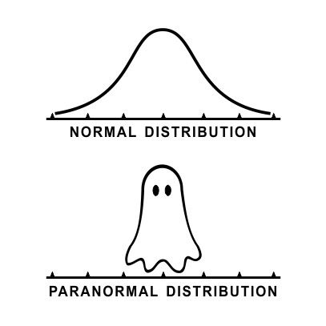

```{r setup, include=FALSE}
require(knitr)
require(kableExtra)
require(gridExtra)
require(ggplot2)
require(reshape2)
require(data.tree)
require(rmutil)
require(rlist)

#Knitr table options
options(knitr.table.format = "html") 

#Chunk options
opts_chunk$set(echo = FALSE)
opts_chunk$set(results = 'asis')
opts_chunk$set(fig.width  = 4)
opts_chunk$set(fig.height = 4)
opts_chunk$set(fig.align='center')

#Function for authomatic theorem, corollary, example, counterexample, property, lemma and definition numbering
source("Rfun/theorem_creator.R")

set.seed(634)
```


```{r echo=FALSE, out.width='50%'}

```

# Deducción del Modelo

Pensemos que estamos midiendo la posición de las estrellas en el cielo. Para ello hay dos formas. 

```{r, fig.width=6}
ggplot() + 
  geom_line(aes(x = c(0,5), y = c(0,0)), linetype = "dashed") +
  geom_line(aes(x = c(0,0), y = c(0,-2)), linetype = "dashed") +
  geom_point(aes(x = 0, y = 0, color = "Mi estimación"), size = 3) + 
  geom_point(aes(x = 5, y = -2, color = "Estrella"), size = 5) +
  theme_bw() +
  scale_color_manual("Valores", values = c("Mi estimación" = "red", "Estrella" = "orange")) +
  annotate("text", x = 2.5, y = 0.1, label = "Error x") + 
  annotate("text", x = -0.2, y = -1, label = "Error y", angle = 90) +
  ggtitle("Mediciones de la posición de una estrella \nen coordenadas cartesianas") +
  xlab("Coordenada x") +
  ylab("Coordenada y")
```

Bajo coordenadas cartesianas $(x,y)$ pensemos que el error de medición es independiente; es decir, si $\rho(x,y)$ es la densidad conjunta de los errores en cada coordenada entonces:

$$
\rho (x,y) = f_X(x) f_Y(y) 
$$

Podemos asumir que los errores de medición tienen la misma distribución en la coordenada $x$ que la coordenada $y$:

$$
\rho (x,y) = f_X(x) f_X(y) 
$$

Por otro lado, supongamos que existe también una representación en coordenadas polares de la posición de la estrella: 
$$
p (r, \theta)  = g_R(r) 
$$

donde el error de medición depende sólo del radio $R$ (no del ángulo). 

```{r, fig.width=6}
ggplot() + 
  geom_line(aes(x = c(0,5), y = c(0,-2)), linetype = "dashed") +
  geom_point(aes(x = 0, y = 0, color = "Mi estimación"), size = 3) + 
  geom_point(aes(x = 5, y = -2, color = "Estrella"), size = 5) +
  theme_bw() +
  scale_color_manual("Valores", values = c("Mi estimación" = "red", "Estrella" = "orange")) +
  annotate("text", x = 2, y = -1, label = "Error r", angle = atan2(-2,5)*180/pi) +
  ggtitle("Mediciones de la posición de una estrella \nen coordenadas polares") +
  xlab("Coordenada x") +
  ylab("Coordenada y")
```


Notamos entonces que:

$$
f_X(x) f_X(y) = g_R\Big( \sqrt{x^2 + y^2} \Big) 
$$
donde sustituimos $r$ por su definición en coordenadas polares. Si tomamos $y = 0$ tenemos que $f_X(x) f_X(0) = g_R(x)$ (a partir de aquí supondré $x > 0$; los otros casos son similares). A partir de esa expresión se tiene que:

$$
f_X(\sqrt{x^2 + y^2} ) f_X(0) = g_R(\sqrt{x^2 + y^2} )
$$

Podemos entonces sustituir:

$$
f_X(x) f_X(y) = f_X(\sqrt{x^2 + y^2} ) f_X(0)
$$

y dividimos entre $f_X(0)^2$ para normalizar: 

$$
\dfrac{f_X(x) \cdot f_X(y)}{f_X(0)\cdot f_X(0)} = \dfrac{f_X\Big( \sqrt{x^2 + y^2} \Big) }{f_X(0)}
$$

Tomamos logaritmo:
$$
\ln \Big(\dfrac{f_X(x)}{f_X(0)}\Big) + \ln \Big(\dfrac{f_X(y)}{f_X(0)}\Big)  = \ln \Bigg( \dfrac{f_X\Big( \sqrt{x^2 + y^2} \Big) }{f_X(0)} \Bigg)
$$

Si reescribimos $h(x) = \ln \Big(\dfrac{f_X(x)}{f_X(0)}\Big)$ tenemos entonces que el problema es hallar una función $h$ tal que:

$$
h(x) + h(y) = h\Big(\sqrt{x^2+y^2}\Big)
$$

Pensando que dicha función es diferenciable podríamos buscarla haciendo:

$$
\dfrac{\partial}{\partial x} \Big[ h(x) + h(y) \Big] = \dfrac{\partial}{\partial x} h\Big(\sqrt{x^2+y^2}\Big)
$$

De donde obtenemos:

$$
h'(x) = h'(\sqrt{x^2 + y^2}) \dfrac{x}{\sqrt{x^2+y^2}}
$$

Notamos entonces que:

$$
\dfrac{h'(x)} {h'(\sqrt{x^2 + y^2})}= \dfrac{x}{\sqrt{x^2+y^2}}
$$ 

Por lo cual, una propuesta para $h'(x) = \alpha x$ para alguna $\alpha$ (no es la única solución al problema, de hecho hay infinitas) y se sigue que $h(x) =  \alpha x^2/2 + C$. La constante debe ser cero pues se tiene que: 

$$
\underbrace{h(x) + h(y)}_{ \alpha x^2/2 +  \alpha y^2/2 + 2C} = \underbrace{h\Big(\sqrt{x^2+y^2}\Big)}_{ \alpha(x^2+y^2)/2 + C}
$$

Al sustituir se tiene que:

$$
\ln \Big( \dfrac{f_X(x)}{f_X(0)} \Big)= \dfrac{\alpha x^2}{2}
$$

de donde despejamos y obtenemos:

$$
f_X(x) = \frac{1}{f_X(0)} e^{\frac{\alpha x^2
}{2}}
$$

Finalmente sabemos que para ser densidad debe integrar a $1$ y ser positiva (por tanto $f_X(0) > 0$) por tanto esto fuerza a $\alpha$ a ser negativo. En particular tomaremos $\alpha = -1$ por ser el negativo más sencillo para este problema (pudo haber sido cualquier otro negativo). 

$$
f_X(x) = \frac{1}{f_X(0)} e^{-\frac{1}{2} x^2}
$$

Y para que integre a $1$:
$$
1 = \int\limits_{-\infty}^{\infty} f_X(x) dx = \frac{1}{f_X(0)} \int\limits_{-\infty}^{\infty}  e^{-\frac{1}{2} x^2} dx
$$

Por tanto $f_X(0) = \int\limits_{-\infty}^{\infty}  e^{-\frac{1}{2} x^2} dx$. La siguiente sección se dedica a evaluar dicha integral. 

# Integración de la gaussiana

De la sección anterior notamos que sólo nos falta por integrar: 

$$
\int\limits_{-\infty}^{\infty}  e^{-\frac{1}{2} x^2} dx
$$

la cual puede reescribirse como:

$$
2 \int\limits_{0}^{\infty}  e^{-\frac{1}{2} x^2} dx
$$

Por lo que la integral a resolver en este caso es $\int\limits_{0}^{\infty}  e^{-\frac{1}{2} x^2} dx$. Para ello definiremos una función auxiliar $g$ que nos ayudará en el proceso de integración: 

$$
g(t) = \Big[ \int\limits_{0}^{t}  e^{-\frac{1}{2} x^2} dx \Big]^2
$$

Notamos que:

$$
\lim_{t \to \infty} \sqrt{g(t)} = \int\limits_{0}^{\infty}  e^{-\frac{1}{2} x^2} dx
$$

De donde toda nuestra atención se enfocará en ese límite. Para resolverlo utilizaremos [el truco de Feynman](http://fy.chalmers.se/~tfkhj/FeynmanIntegration.pdf) una técnica que no se estudia en las clases tradicionales de Cálculo^[Otra opción es usar integrales polares pero no necesariamente todos sabemos hacerlo.]. 

La derivada de $g$ está dada por:

$$
\dfrac{dg}{dt} = 2 \Bigg[ \int\limits_{0}^{t} e^{-x^2/2}dx \Bigg] e^{-t^2/2} = 2 \int\limits_{0}^{t} e^{-(t^2+x^2)/2}dx
$$

Hacemos el cambio de variable $u = x/t$ lo que implica que $x = ut$ y que $dx = tdu$ donde además cuando $x \in (0,t)$ entonces $u \in (0,1)$:


$$
\dfrac{dg}{dt} =  2 \int\limits_{0}^{1} t e^{-(1+u^2)t^2 /2}du
$$

Notamos que:

$$
\dfrac{\partial}{\partial t}  \Bigg[ - \dfrac{2e^{-(1+u^2)t^2/2}}{1+u^2} \Bigg] = 2te^{-(1+u^2)t^2/2}
$$

En resumen:

$$
\dfrac{dg}{dt} = \int\limits_{0}^{1} \dfrac{\partial}{\partial t}  \Bigg[ - \dfrac{2e^{-(1+u^2)t^2/2}}{1+u^2} \Bigg]  du = \dfrac{d}{d t}  \int\limits_{0}^{1}  \Bigg[ - \dfrac{2e^{-(1+u^2)t^2/2}}{1+u^2} \Bigg]  du 
$$

Por tanto, mediante integración obtenemos que:

$$
g(t) =  \int\limits_{0}^{1}  \Bigg[ - \dfrac{2e^{-(1+u^2)t^2/2}}{1+u^2} \Bigg]  du  + C
$$

Para determinar la constante de integración $C$ observamos que si $t \to 0$ se tiene:

$$
\lim_{t\to 0} g(t) = \Big[ \int\limits_{0}^{0}  e^{-\frac{1}{2} x^2} dx \Big]^2 = 0
$$

Mientras que por otro lado:

\begin{equation}
\begin{aligned}
\lim_{t\to 0}  g(t) &=  \lim_{t\to 0}   \int\limits_{0}^{1}  \Bigg[ - \dfrac{2e^{-(1+u^2)t^2/2}}{1+u^2} \Bigg]  du  + C 
\\ & = \lim_{t\to 0}   -2 \int\limits_{0}^{1}  \Bigg[  \dfrac{1}{1+u^2} \Bigg]  du  + C 
\\ & = -2\arctan(u)\Bigg|_{u = 0}^{u = 1} + C 
\\ & = -2 \dfrac{\pi}{4} + C 
\end{aligned}
\end{equation}

Por tanto, $C = \pi/2$. Finalmente, $g(t) = \int\limits_{0}^{1}  \Bigg[ - \dfrac{2e^{-(1+u^2)t^2/2}}{1+u^2} \Bigg]  du  + \dfrac{\pi}{2}$. Por otro lado, notamos que:

$$
\lim_{t \to \infty} g(t) = \int\limits_{0}^{1}  \Bigg[ - \lim_{t \to \infty} \dfrac{2e^{-(1+u^2)t^2/2}}{1+u^2} \Bigg]  du  + \dfrac{\pi}{2} = \dfrac{\pi}{2}
$$

Por lo cual:
$$
\lim_{t \to \infty} \sqrt{g(t)} = \int\limits_{0}^{\infty}  e^{-\frac{1}{2} x^2} dx  = \sqrt{\dfrac{\pi}{2}}
$$

De donde:

$$
\int\limits_{-\infty}^{\infty}  e^{-\frac{1}{2} x^2} dx = \sqrt{2 \pi}
$$
Concluimos entonces que $f_X(0) = \sqrt{2 \pi}$ lo cual nos permite definir la distribución normal estándar:

```{r}
form <- "
Una variable aleatoria $Z$ tiene una distribución $\\text{NormalEstándar}$ (o $\\text{Normal}(0,1)$) si:
$$
f_X(x) =  \\frac{1}{\\sqrt{2 \\pi}} e^{-\\frac{x^2}{2}} 
$$

"

build_theorem("Modelo",form, proof = "", name = "Normal Estándar", id ="normal" )
```

A partir de un cambio de variable podemos definir el modelo $\text{Normal}(\mu,\sigma^2)$ en general:

```{r}
form <- "
Sea $Z$ variable aleatoria $Z$ con distribución $\\text{NormalEstándar}$ (o $\\text{Normal}(0,1)$). Para $\\sigma > 0$ definimos una nueva variable aleatoria $X$ dada por:
$$
X = \\sigma Z + \\mu
$$
Entonces la función de densidad de $X$ es:
$$
f_X(x) = \\dfrac{1}{\\sqrt{2\\pi\\sigma^2}} e^{-\\frac{(x-\\mu)^2}{2\\sigma^2}} 
$$
"

dem <- "
Operaremos con la función de distribución acumulada:
\\begin{equation}
\\begin{aligned}
F_X(x) & = \\mathbb{P}(X \\leq x) \\\\
& = \\mathbb{P}(\\sigma Z + \\mu \\leq x) \\\\
& = \\mathbb{P}( Z  \\leq \\frac{x - \\mu}{\\sigma}) \\\\
& = F_Z\\Big( \\frac{x - \\mu}{\\sigma} \\Big)
\\end{aligned}
\\end{equation}
de donde, al derivar, obtenemos la densidad:
\\begin{equation}
\\begin{aligned}
f_X(x) & = \\dfrac{d}{dx} F_X(x) \\\\
& = \\dfrac{d}{dx} F_Z\\Big( \\frac{x - \\mu}{\\sigma}  \\Big) \\\\
& = f_Z\\Big( \\frac{x - \\mu}{\\sigma} \\Big) \\cdot \\frac{1}{\\sigma} \\\\
& =  \\dfrac{1}{\\sqrt{2\\pi}} e^{-\\frac{\\big(\\frac{x - \\mu}{\\sigma}\\big)^2}{2}}\\cdot \\frac{1}{\\sigma}\\\\
& = \\dfrac{1}{\\sqrt{2\\pi\\sigma^2}} e^{-\\frac{(x-\\mu)^2}{2\\sigma^2}} 
\\end{aligned}
\\end{equation}
"

build_theorem("Teorema",form, proof = dem, name = "Normal($\\mu,\\sigma$)", id ="normalgral" )
```

```{r}
form <- "
Una variable aleatoria $X$ se distribuye $\\text{Normal}(\\mu,\\sigma)$ si su densidad está dada por:
$$
f_X(x) = \\dfrac{1}{\\sqrt{2\\pi\\sigma^2}} e^{-\\frac{(x-\\mu)^2}{2\\sigma^2}} 
$$
"

build_theorem("Modelo",form, proof = "", name = "Normal($\\mu,\\sigma$)", id ="normalgral2" )
```

La normal se ve así:

```{r, fig.width=8}
xvec <- seq(-5,10,length.out = 1000)
ggplot() +
  geom_line(aes(x = xvec, y = dnorm(xvec,0,1), color = "µ = 0 & σ = 1")) +
  geom_line(aes(x = xvec, y = dnorm(xvec,0,2), color = "µ = 0 & σ = 2")) +
  geom_line(aes(x = xvec, y = dnorm(xvec,0,0.5), color = "µ = 0 & σ = 0.5")) +
  geom_line(aes(x = xvec, y = dnorm(xvec,5,1), color = "µ = 5 & σ = 1")) +
  geom_line(aes(x = xvec, y = dnorm(xvec,5,0.5), color = "µ = 5 & σ = 0.5")) +
  geom_line(aes(x = xvec, y = dnorm(xvec,5,2), color = "µ = 5 & σ = 2")) +
  theme_bw() +
  ggtitle("Diferentes densidades normales") +
  scale_color_manual("Parámetros", values = rainbow(6)) +
  xlab("x") +
  ylab("y")
  
```

# Funciones generadoras, valor esperado y otras propiedades

## Valor esperado y varianza
Podemos utilizar que cualquier variable aleatoria normal $X\sim\text{Normal}(\mu,\sigma^2)$ puede escribirse como:
$$
X = \sigma Z + \mu
$$
donde $Z\sim\text{Normal(0,1)}$ es una normal estándar. A través de propiedades de valor esperado podemos ver que:

\begin{equation}
\begin{aligned}
\mathbb{E}[X] & = \sigma \cdot \mathbb{E}[Z] + \mu \\
\text{Var}[X] & = \sigma^2 \cdot \text{Var}[Z]
\end{aligned}
\end{equation}

Basta entonces con calcular $\mathbb{E}[Z]$ y $\text{Var}[Z]$:
\begin{equation}
\begin{aligned}
\mathbb{E}[Z] & = \int\limits_{-\infty}^{\infty} z f_Z(z) dz \\
& = \int\limits_{-\infty}^{\infty} z \dfrac{1}{\sqrt{2\pi}} e^{-\frac{z^2}{2}} dz \\
& = 2 \int\limits_{0}^{\infty} z \dfrac{1}{\sqrt{2\pi}} e^{-\frac{z^2}{2}} dz \\
& = 2 \int\limits_{0}^{\infty} \dfrac{1}{\sqrt{2\pi}} e^{-u} du \\
& = 0.
\end{aligned}
\end{equation}
donde hicimos el cambio de variable $u = \frac{z^2}{2}$ y $du = zdz$

Por otro lado, bajo el cambio de variable $u = z$, $dv = z e^{-\frac{z^2}{2}}dz$ con $du = dz$ y $v = - e^{-\frac{z^2}{2}}$ podemos calcular la varianza:

\begin{equation}
\begin{aligned}
\text{Var}[Z] & = \int\limits_{-\infty}^{\infty} z^2 f_Z(z) dz \\
& = \int\limits_{-\infty}^{\infty} z^2 \dfrac{1}{\sqrt{2\pi}} e^{-\frac{z^2}{2}} dz \\
& = \dfrac{1}{\sqrt{2\pi}} \Bigg[ \underbrace{- z e^{-\frac{z^2}{2}} \bigg|_{z=0}^{z=\infty}}_{uv} + \underbrace{\int\limits_{-\infty}^{\infty} e^{-\frac{z^2}{2}} dz}_{\int v du} \Bigg] \\
& = \underbrace{\int\limits_{-\infty}^{\infty} \dfrac{1}{\sqrt{2\pi}} e^{-\frac{z^2}{2}} dz }_{\text{Densidad Normal}(0,1)}¸\\
& = 1
\end{aligned}
\end{equation}

Al combinar los resultados anteriores podemos concluir el siguiente teorema:

```{r}
form <- "
Una variable aleatoria $X\\sim\\text{Normal}(\\mu,\\sigma)$ tiene media $\\mu$ y varianza $\\sigma^2$
"

build_theorem("Teorema",form, proof = "Lo anterior", name = "Media y varianza de una normal", id ="mvarnormal" )
```

## Moda
La moda se define como el valor $x$ donde la densidad alcanza su máximo en el caso de las continuas. Para la $\text{Normal}(\mu,\sigma^2)$, buscamos el valor que maximiza:
$$
f_X(x) = \dfrac{1}{\sqrt{2\pi\sigma^2}}e^{-\frac{(x-\mu)^2}{2\sigma^2}}
$$
Como la función es diferenciable, derivamos e igualamos a $0$. Nos podemos ahorrar el $\frac{1}{\sqrt{2\pi\sigma^2}}$ por ser una constante positiva:

$$
f'_X(x) = - \frac{(x-\mu)}{\sigma^2}\cdot e^{-\frac{(x-\mu)^2}{2\sigma^2}}
$$

de donde obtenemos $x = \mu$. Para verificar que es un máximo comprobamos la convexidad en torno al punto:

$$
f''_X(x) = - \frac{e^{-\frac{(x-\mu)^2}{2\sigma^2}}}{\sigma^2} + \frac{(x-\mu)^2}{\sigma^4}\cdot e^{-\frac{(x-\mu)^2}{2\sigma^2}}
$$

La convexidad cambia en $\mu \pm \sigma^2$.  En particular, dicha derivada en torno a $x = \mu$ es negativa por lo cual es cóncava y se tiene que $\mu$ es un máximo; por tanto:

```{r}
form <- "
Una variable aleatoria $X\\sim\\text{Normal}(\\mu,\\sigma)$ tiene moda $\\mu$.
"

build_theorem("Teorema",form, proof = "Lo anterior", name = "Moda de una normal", id ="modanormal" )
```


## Función generadora de momentos

La función generadora de momentos para una $\text{Normal}(\mu,\sigma)$ puede calcularse, también, a través de una $\text{Normal}(0,1)$. Para ello sea $X\sim \text{Normal}(\mu,\sigma)$ y escribamos $X$ como $X = \sigma Z + \mu$ donde $Z\sim\text{Normal}(0,1)$. Entonces tenemos:
$$
M_X(t) = \mathbb{E}[e^{tX}] = \mathbb{E}[e^{t(\sigma Z + \mu)}] = \mathbb{E}[e^{t\sigma Z}e^{t \mu}] = e^{t\mu} M_Z(\sigma t) 
$$
donde $M_Z$ es la función generadora de momentos de $Z$. Calculamos entonces la de esta última:

\begin{equation}
\begin{aligned}
M_Z(\tau) & = \mathbb{E}[e^{tZ}] \\
& = \int\limits_{-\infty}^{\infty} e^{tz} \dfrac{1}{\sqrt{2\pi}}e^{-\frac{z^2}{2}} dz \\
& = \int\limits_{-\infty}^{\infty} \dfrac{1}{\sqrt{2\pi}}e^{tz-\frac{z^2}{2}} dz \\
& = \int\limits_{-\infty}^{\infty} \dfrac{1}{\sqrt{2\pi}}e^{-(\frac{z}{\sqrt{2}}-\frac{t}{\sqrt{2}})^2 +\frac{t^2}{2}}dz \\
& = e^{\frac{t^2}{2}}\int\limits_{-\infty}^{\infty} \underbrace{\dfrac{1}{\sqrt{2\pi}}e^{-\frac{(z-t)^2}{2}}}_{\text{Normal}(t,1)} dz \\
& =  e^{\frac{t^2}{2}}.
\end{aligned}
\end{equation}
Lo anterior nos permite concluir el teorema:

```{r}
form <- "
Una variable aleatoria $X\\sim\\text{Normal}(\\mu,\\sigma)$ tiene función generadora de momentos: 
$$
M_X(t) = e^{\\mu t + \\frac{t^2 \\sigma^2}{2}}
$$
"

  build_theorem("Teorema",form, proof = "Lo anterior", name = "Generadora de momentos de una normal", id ="gennormal" )
```

## Mediana

Para encontrar la mediana de una variable aleatoria normal utilizaremos un teorema mucho más general que establece que, si una densidad es simétrica en torno a un valor $m$ entonces $m$ es la mediana. Esto lo podemos ver, intuitivamente, en la gráfica inferior con una densidad Laplace:

```{r, fig.width=8}

x1 <- seq(-5,0,length.out = 1000) + 2
x2 <- seq(0,5,length.out = 1000) + 2
x <- c(x1,x2)
y1 <- dlaplace(x1, 2)
y2 <- dlaplace(x2, 2)
y <- c(y1, y2)

ggplot() +  theme_bw() +
  geom_ribbon(aes(x = x1, ymin = 0, ymax = y1), fill = "orange") + 
  geom_ribbon(aes(x = x2, ymin = 0, ymax = y2), fill = "red") + 
  geom_line(aes(x = x, y = y), color = "black", size = 2) +
  geom_vline(aes(xintercept = 2), linetype = "dotted", color = "black", size = 1) +
  xlab("x") + ylab("Densidad") +
  annotate("text", x = 1.25, y = 0.1, label = "50%", size = 8, color = "white") + 
  annotate("text", x = 2.75, y = 0.1, label = "50%", size = 8, color = "white")
```

Lo cual nos inspira para el siguiente teorema:
```{r}
form <- "
Sea $X$ una variable aleatoria continua  con densidad $f_X$ simétrica en torno a $m$; es decir:
$$
f_X(m + x) = f_X(m - x)
$$
Entonces $m$ es la mediana de la distribución. 
"

dem <- "
Notamos que:
\\begin{equation}
\\begin{aligned}
1 & = \\int\\limits_{-\\infty}^{\\infty} f_X(x) dx \\\\
& = \\underbrace{\\int\\limits_{-\\infty}^{0} f_X(x) dx}_{u = m-x; du = -dx} + \\underbrace{\\int\\limits_{0}^{\\infty} f_X(x) dx}_{w = m + x; dw = dx} \\\\
& = - \\int\\limits_{\\infty}^{m} f_X(u) du + \\int\\limits_{m}^{\\infty} f_X(w) dw \\\\
& = 2 \\int\\limits_{m}^{\\infty} f_X(w) dw 
\\end{aligned} 
\\end{equation}
Lo cual implica que:
$$
P(X \\geq m) = 1 - P(X \\leq m) = \\int\\limits_{m}^{\\infty} f_X(w) dw =  \\dfrac{1}{2}
$$
y por tanto $m$ es la mediana. 
"

build_theorem("Teorema",form, proof = dem, name = "Mediana de simétricas", id ="medianasim" )
```

En particular, como una normal es simétrica en torno a $\mu$ tenemos el siguiente teorema:

```{r}
form <- "
Una variable aleatoria $X\\sim\\text{Normal}(\\mu,\\sigma)$ tiene mediana:
$$
\\text{Mediana}[X] = \\mu
$$
"

  build_theorem("Teorema",form, proof = "La simetría de la normal.", name = "Mediana de una normal", id ="mednormal" )
```


# Teorema central del límite

Esta sección contiene sólo una introducción a un tema que nos dice por qué la normal es tan importante. Para ver esto, haremos un análisis de distribuciones conocidas. El proceso de simulación es el siguiente:

1. Tomaré una muestra aleatoria $M_i = \{X_1, X_2,\dots,X_n \}$ de $n$ variables aleatorias independientes todas con la misma distribución. Supongamos que dichas variables tienen media finita $\mu$, varianza finita $\sigma^2 > 0$ y su generadora de momentos existe para algún intervalo abierto.

2. Calcularé:

$$
Z_i(n) = \sqrt{n} \Big( \dfrac{1}{n}\sum\limits_{k=1}^{n} X_k - \mu \Big)
$$

3. Repetiré el proceso para $i = 1,\dots, 1000$ y graficaré un histograma de dichas muestras. Notaremos que conforme aumentamos el tamaño de muestra $n$, las $Z_i$ se aproximan en distirbución a una normal con varianza $\sigma^2$. 

El siguiente código de `R` ejecuta las simulaciones: 

```{r, fig.width=10, echo = TRUE}
TeoremaCentralLimite <- function(numero_simulaciones = 1000, n = c(10,100,1000,10000), 
                                 distribucion = rpois, mu = 1, sigma = 1, bins = 50, 
                                 ncol = 2, distname = "Poisson(1)", 
                                 rcolor = sample(rainbow(100),1), ...){
  #Creamos
  plot_list <- list()
  
  for (k in n){
    
    #Guardamos las Zi en un vector
    Z <- rep(NA, numero_simulaciones)
    
    #Simulamos todas las simulaciones
    for (i in 1:numero_simulaciones){
      simulaciones_X <- distribucion(n = k, ...)
      Z[i]         <- sqrt(k)*(sum(simulaciones_X/k) - mu)
    }
    
    #Graficación
    x <- seq(min(Z)-1, max(Z) + 1, length.out = 1000)
    y <- dnorm(x, sd = sigma)
    plot_list <- list.append(
      plot_list, 
      ggplot() + 
      geom_histogram(aes(x = Z, y = ..density..), bins = bins, fill = rcolor, 
                     data = data.frame(Z = Z)) +
      geom_line(aes_string(x = x, y = y), color = "black", data = data.frame(x = x, y = y)) +
      ggtitle(paste0("Simulaciones con ", distname,"\nn = ", k)) +
      xlab("Z") + ylab("Densidad de Z") +
      theme_bw()
    )
  }
  do.call("grid.arrange", c(plot_list, ncol = ncol))
}
```

Para la Poisson:
```{r, fig.width=10, fig.height=8, echo=TRUE}
TeoremaCentralLimite(lambda = 1, distname = "Poisson(1)")
```

Uniforme:
```{r, fig.width=10, fig.height=8, echo=TRUE}
TeoremaCentralLimite(distribucion = runif, mu = 1/2, sigma = 1/12, distname = "Uniforme(0,1)")
```

Exponencial
```{r, fig.width=10, fig.height=8, echo=TRUE}
TeoremaCentralLimite(distribucion = rexp, mu = 1/5, sigma = 1/25, rate = 5, distname = "Exp(5)")
```

Gama:
```{r, fig.width=10, fig.height=8, echo=TRUE}
TeoremaCentralLimite(distribucion = rgamma, mu = 1, sigma = 0.5, shape = 2, scale = 0.5, distname = "Gama(2,1/2)")
```

E inclusive la binomial
```{r, fig.width=10, fig.height=8, echo=TRUE}
TeoremaCentralLimite(distribucion = rbinom, mu = 4.5, sigma = 2.475, size = 10, prob = 0.45, distname = "Binomial(10,0.45)")
```

Observa que todas poco a poco empiezan a tomar una forma de una curva normal. Lo que está pasando es el Teorema Central del Límite. El cual nos indica que, cuando $n \to \infty$

$$
\lim_{n\to\infty} Z(n) = \lim_{n\to\infty} \sqrt{n} \Big( \dfrac{1}{n}\sum\limits_{k=1}^{n} X_k - \mu \Big) \sim \textrm{Normal}(0,\sigma^2)
$$

Podemos reescribir esto en el siguiente teorema:

```{r}
form <- "
Sean $X_1,X_2,\\dots,$ variables aleatorias independientes idénticamente distribuidas con media finita $\\mu$ y varianza finita $\\sigma^2 > 0$. Luego: 
$$
 \\lim_{n\\to\\infty} \\dfrac{\\sum\\limits_{k=1}^{n} X_k - n \\mu}{ \\sqrt{n \\sigma^2}} \\sim \\textrm{Normal}(0,1)
$$
"

  build_theorem("Teorema",form, proof = "Muy complicada para Proba 1", name = "Teorema del Límite Central", id ="TCL" )
```


# Distribución lognormal

## Idea

## Media y varianza

## ¿Generadora de momentos?
